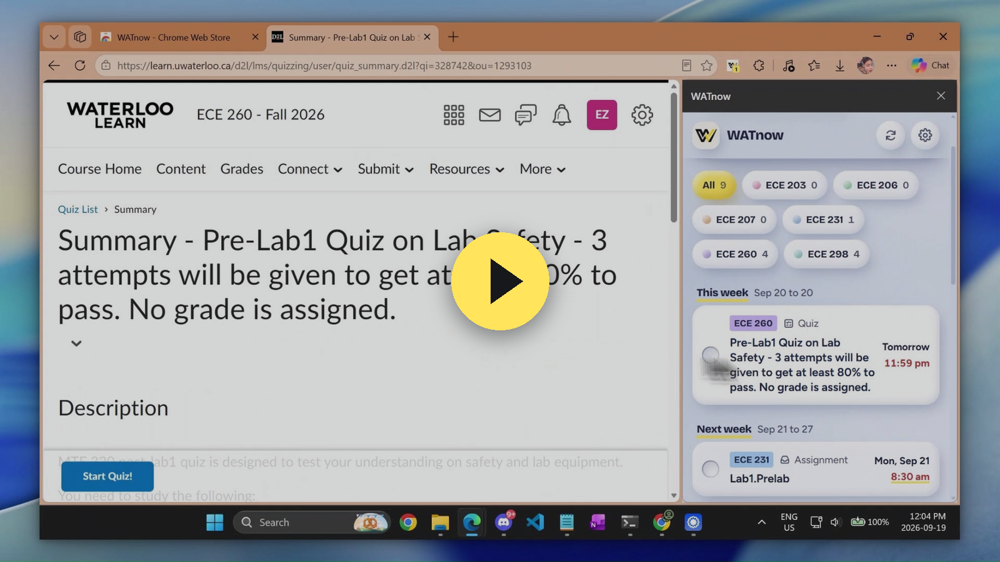
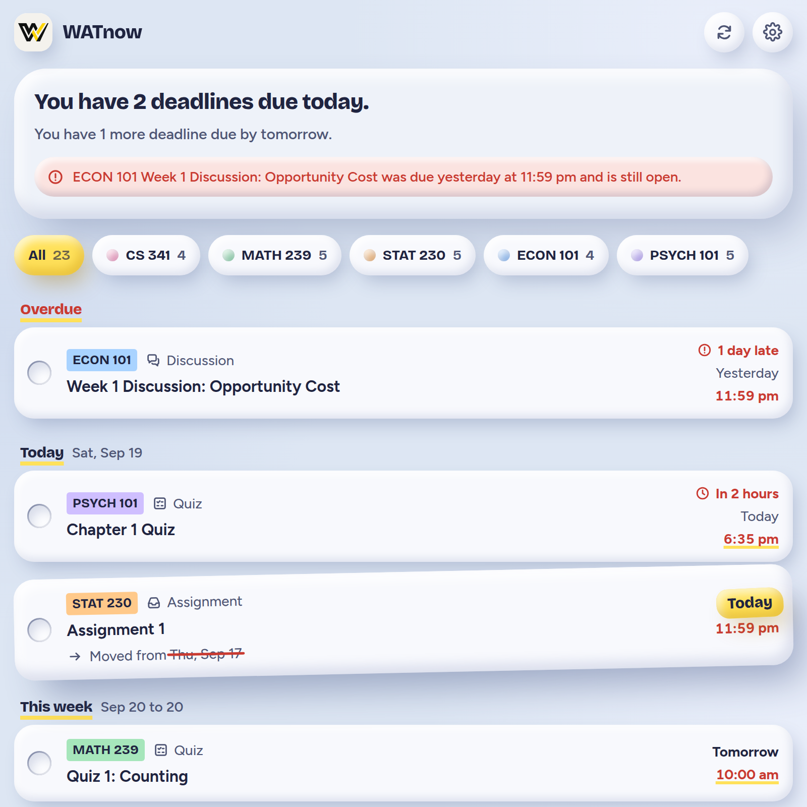
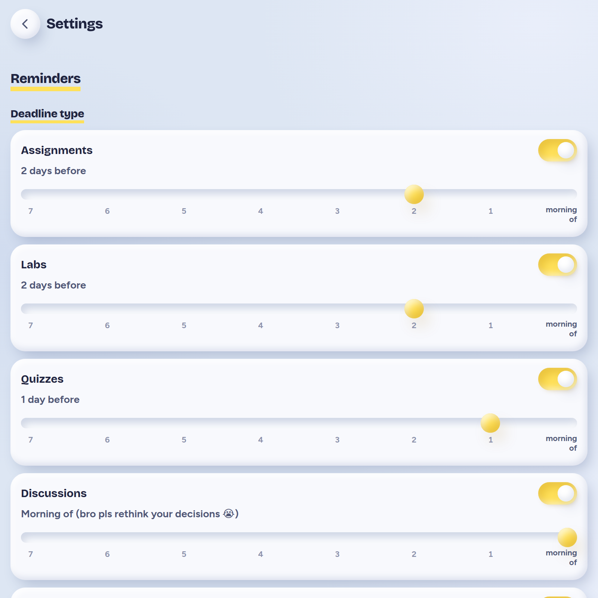
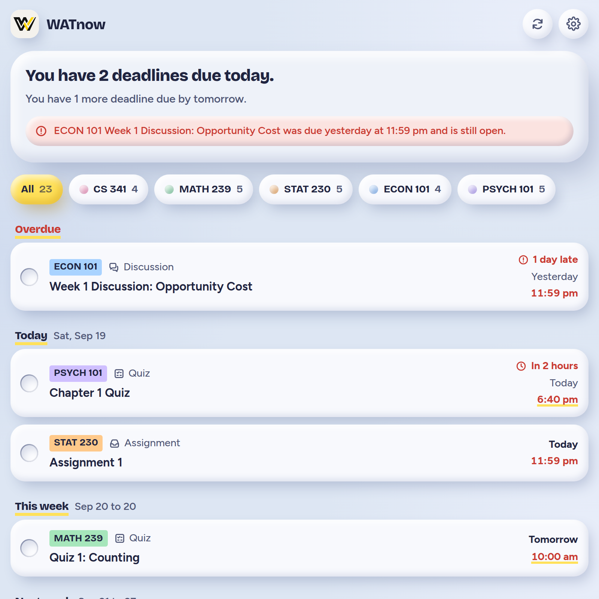
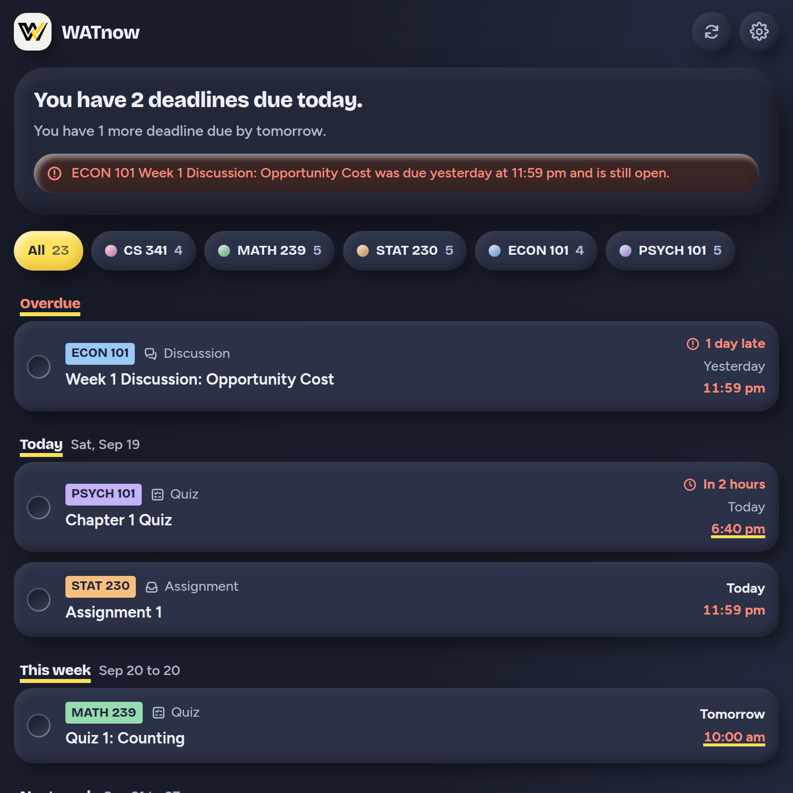

# WATnow

**All your Learn deadlines in one side panel, updated when profs move dates, with reminders before things close.**

A Chrome extension for University of Waterloo students.

[**Get early access**](mailto:eric@ugmi.ca) &nbsp;·&nbsp; [Website](https://watnow.ugmi.ca) &nbsp;·&nbsp; [Privacy policy](https://watnow.ugmi.ca/privacy/)

---

WATnow on a real Learn account, from the first scan to the reminder settings. GitHub can't play video in a readme, so the picture opens the clip on <a href="https://watnow.ugmi.ca/">watnow.ugmi.ca</a>.

## What you get

- Every dated thing across your courses sits in one list, sorted into Overdue, Today, This week, Next week and Later. Click an item and it opens on Learn.
- WATnow rereads Learn every 30 minutes while Chrome is open. When a prof pushes a due date, the item shows the new date highlighted with the old one crossed out underneath, so you never have to go back and correct a calendar by hand.
- Assignments, labs, quizzes and discussions each get their own reminder lead time, anywhere from seven days before the due date to the morning it's due. Reminders stop once Learn shows you submitted, or once you tick the item off yourself.
- The panel still works when Learn is down or your laptop is offline. It keeps showing the list it last read and keeps your reminders, then tries again at the next check.

## What it looks like

<table>
<tr>
<td width="50%"></td>
<td width="50%"></td>
</tr>
<tr>
<td>A prof pushed Assignment 1 to today. The new date sits on a yellow pill and the date it used to be is crossed out underneath.</td>
<td>Every kind of deadline gets its own lead time, and you can switch a kind off completely.</td>
</tr>
<tr>
<td></td>
<td></td>
</tr>
<tr>
<td>The list runs from overdue items down to the weeks ahead, and the card at the top says how much is actually due.</td>
<td>The panel follows your Chrome theme, or you can pin it to light or dark.</td>
</tr>
</table>

Screenshots were taken against made-up courses, so no real student's data is shown.

## Getting in

WATnow is in a private beta, so access goes out one person at a time. Email [eric@ugmi.ca](mailto:eric@ugmi.ca) or send a DM to [@sleppyeric](https://www.instagram.com/sleppyeric/) on Instagram and I'll set you up.

Once you have it, sign in to learn.uwaterloo.ca, click the WATnow icon in your toolbar, and the panel fills itself in.

## What it does with your data

This repo is public so you can read exactly what the extension does with your Learn account before you install it.

- It reads Learn from inside your browser, using the session you're already signed in with. It never sees your password.
- It only sends GET requests to `learn.uwaterloo.ca/d2l/api/`, so it can't change anything on Learn.
- Your courses, deadlines and settings are saved in your browser's extension storage on your own computer.
- The only thing it sends anywhere is an anonymous count: once when you install it, once each time you open the panel, and once a day if you used it that day. Each one carries a random install ID and the version number, nothing from Learn. That code is in [`extension/src/core/usage.js`](extension/src/core/usage.js).

The full policy is at [watnow.ugmi.ca/privacy](https://watnow.ugmi.ca/privacy/).

## Running it from this repo

`extension/` is the real build, the same one people install: it reads live Learn only, and the demo fixtures used for recording videos are stripped out. Open `chrome://extensions`, turn on Developer mode, and use **Load unpacked** on the `extension/` folder.

---

WATnow is not affiliated with or endorsed by D2L or the University of Waterloo.

Made by Eric Zou. Questions go to [eric@ugmi.ca](mailto:eric@ugmi.ca).
