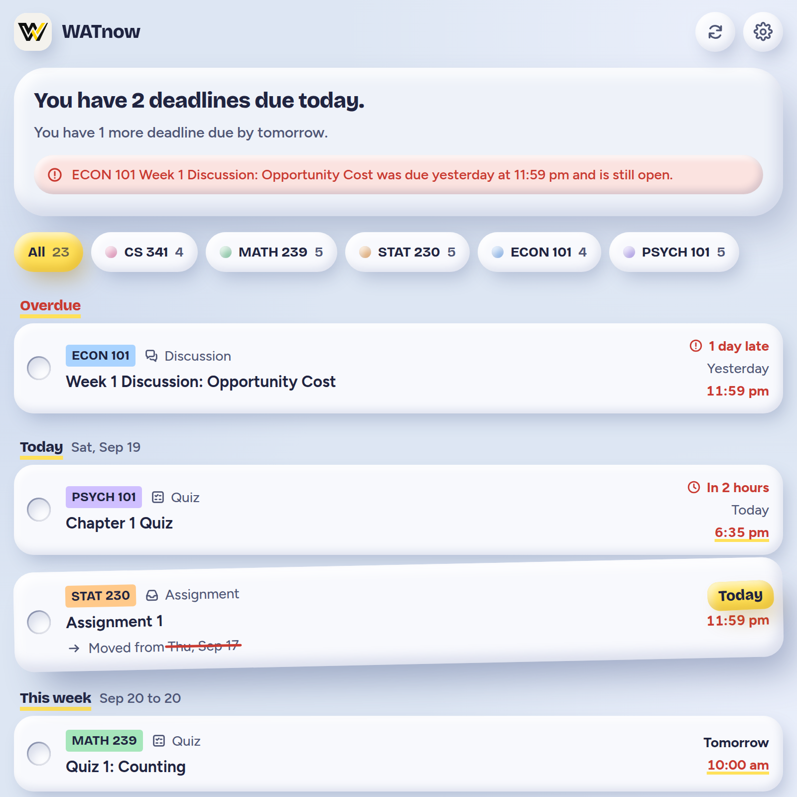
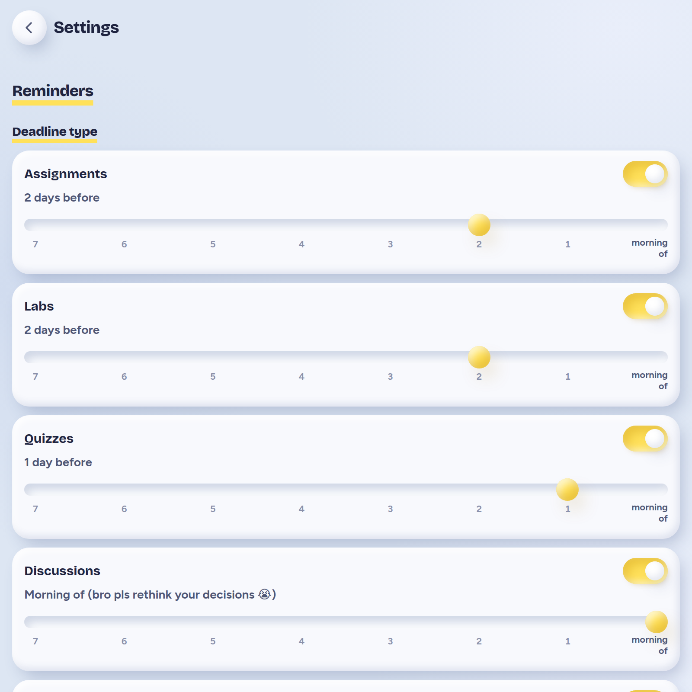
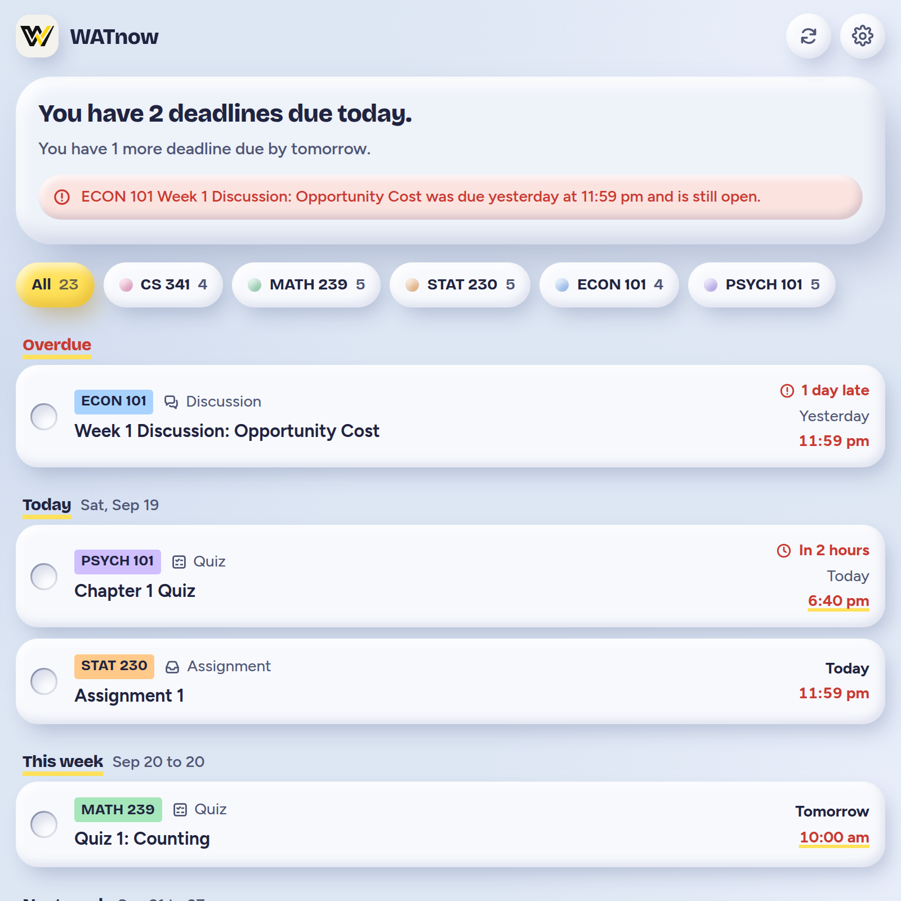
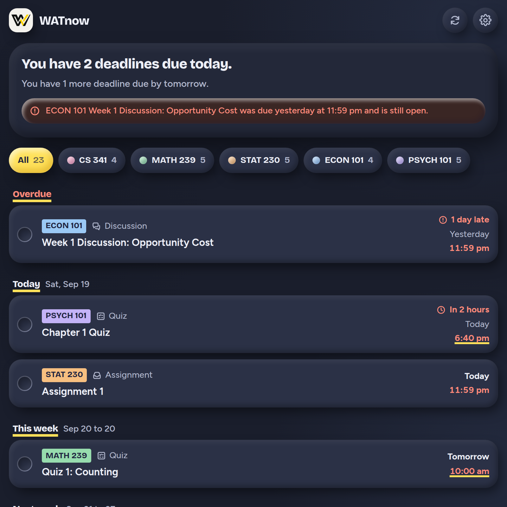

# WATnow &nbsp;

**All your course deadlines in one side panel, updated when profs move dates, with reminders before things close.**

A browser extension for students at Waterloo, Guelph, Laurier, McMaster, Queen's, Western and TMU, for Chrome and for Firefox. It reads your school's Brightspace site, which Waterloo calls Learn.

[Chrome Web Store](https://chromewebstore.google.com/detail/watnow/iikileknbmejmkaonlhkjkpbfnkidibh) &nbsp;·&nbsp; Firefox Add-ons (listing pending) &nbsp;·&nbsp; [Website](https://watnow.ugmi.ca) &nbsp;·&nbsp; [Privacy policy](https://watnow.ugmi.ca/privacy/)

https://github.com/user-attachments/assets/0308c84c-db48-4fef-b2ab-1eab881b1191

---

## What you get

- Every dated thing across your courses sits in one list, sorted into Overdue, Today, This week, Next week and Later. Click an item and it opens on your course site. On Chrome the list lives in the side panel, on Firefox in the sidebar.
- WATnow rereads your course site every 30 minutes while your browser is open. When a prof pushes a due date, the item shows the new date highlighted with the old one crossed out underneath, so you never have to go back and correct a calendar by hand.
- Assignments, labs, quizzes and discussions each get their own reminder lead time, anywhere from seven days before the due date to the morning it's due. Reminders stop once your course site shows you submitted, or once you tick the item off yourself.
- Waterloo students can connect Crowdmark too, and its assignments show up in the same list under the matching course.
- Your deadlines export as a calendar file for Google Calendar, Apple Calendar, Outlook or anything else that reads one. Importing it again later moves the dates that changed instead of leaving you a second copy of everything.
- The panel still works when your course site is down or your laptop is offline. It keeps showing the list it last read and keeps your reminders, then tries again at the next check.

## What it looks like

<table>
<tr>
<td width="50%"></td>
<td width="50%"></td>
</tr>
<tr>
<td>A prof pushed Assignment 1 to today. The new date sits on a yellow pill and the date it used to be is crossed out underneath.</td>
<td>Every kind of deadline gets its own lead time, and you can switch a kind off completely.</td>
</tr>
<tr>
<td></td>
<td></td>
</tr>
<tr>
<td>The list runs from overdue items down to the weeks ahead, and the card at the top says how much is actually due.</td>
<td>The panel follows your browser theme, or you can pin it to light or dark.</td>
</tr>
</table>

## Usage

These numbers come from the anonymous install counts described under "What it does with your data", so they are Chrome only. They were last updated on October 3, 2026.

- 1,541 people have installed WATnow.
- 1,070 of them opened it in the last 7 days.
- 36% opened it again the day after they installed it, and 59% came back on some later day.

The user count on the Chrome Web Store runs a few days behind these numbers.

## Install

Install WATnow from the [Chrome Web Store](https://chromewebstore.google.com/detail/watnow/iikileknbmejmkaonlhkjkpbfnkidibh). Click the WATnow icon in your toolbar and choose your school. Sign in to your course site if you aren't already, and the panel fills itself in. Waterloo students can also select **Connect Crowdmark** in the panel to see Crowdmark deadlines beside their Learn ones.

The Firefox build, for Firefox, Nightly, Zen, LibreWolf and other Firefox-based browsers, is not on addons.mozilla.org yet. Until it is, build it from this repo with the steps under "Running it from this repo".

Firefox for Android is not supported, because extensions cannot open a sidebar there.

## What it does with your data

This repo is public so you can read exactly what the extension does with your school account before you install it.

- It reads your course site from inside your browser, using the session you're already signed in with. It never sees your password.
- It only sends GET requests: to your school's `/d2l/api/`, to a quiz's summary page or a closed dropbox's submission history to see whether you've handed it in, and to Crowdmark's student API if you connect it. It can't change anything on any site it reads.
- Waterloo's Learn is the only site it can reach when you install it. Every other site is an optional permission your browser asks you about, and nothing is read from one until you say yes:
  - another school's Brightspace, if you pick that school instead of Waterloo. WATnow reads the same `/d2l/api/` routes on it.
  - Crowdmark, if you select **Connect Crowdmark**. It reads `app.crowdmark.com/api/v2/student/` for your courses and their assignment due dates. Disconnecting takes the permission away and its deadlines leave the panel on the next check.
- Your courses, deadlines and settings are saved in your browser's extension storage on your own computer.
- The calendar file is made on your computer and sent nowhere. Importing it into a calendar is something you do yourself, with a file you can read first.
- The only thing it sends anywhere is an anonymous count: once when you install it, once each time you open the panel, and once a day if you used it that day. Each one carries a random install ID and the version number, nothing from your courses. That code is in [`extension/src/core/usage.js`](extension/src/core/usage.js).
- On Firefox the count is listed as optional technical and interaction data. Firefox shows it ticked when you install WATnow, and you can untick it there or later in `about:addons`, after which nothing is sent.
- The Google Calendar sync code is in this repo but switched off in the store builds, so nothing goes to Google. When it is switched on, connecting it shares course and deadline details with Google. See [what the connection shares and saves](extension/src/calendar/README.md#permissions--scopes).

The full policy is at [watnow.ugmi.ca/privacy](https://watnow.ugmi.ca/privacy/).

## Running it from this repo

This section is for developers. Most people should use the Chrome Web Store link above, which also keeps the extension updated.

`extension/` is the same build that goes to the stores: it reads live course sites only, and the demo fixtures used for recording videos are stripped out. One folder serves both browsers, so its `manifest.json` carries both sets of keys (`service_worker` and `scripts`, `side_panel` and `sidebar_action`) and the code picks between them at runtime in [`extension/src/core/env.js`](extension/src/core/env.js). Each browser ignores the other's keys with a warning.

**Chrome.** Open `chrome://extensions`, turn on Developer mode, and use **Load unpacked** on the `extension/` folder.

**Firefox.** Either `npm install && npm run dev:ff`, which opens a clean profile with the extension loaded and reloads it as you edit, or go to `about:debugging#/runtime/this-firefox` and use **Load Temporary Add-on** on `extension/manifest.json`. Expect three manifest warnings there about the Chrome-only keys.

**Packaging.** `npm run build:ff` and `npm run build:chrome` stage `dist/firefox` and `dist/chrome` with a manifest holding only that browser's keys ([`tools/pack.mjs`](tools/pack.mjs)) and zip them for the stores. `npm run lint:ff` runs `web-ext lint` over the staged Firefox build.

For Google Calendar setup, account access and developer notes, see the [Google Calendar README](extension/src/calendar/README.md).

---

WATnow is not affiliated with or endorsed by D2L, Crowdmark, or any of the universities above.

Made by Eric Zou. Questions go to [eric@ugmi.ca](mailto:eric@ugmi.ca).
